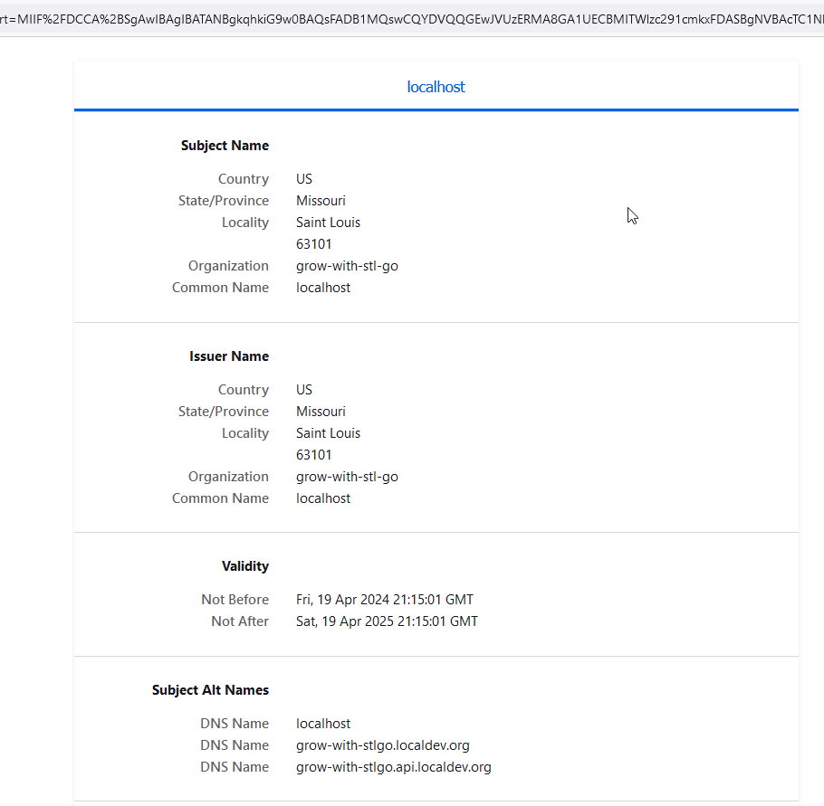

# Cryptography

Most of what we're doing is trying to prevent the unintentional diminution of information to people who shouldn't see it.  Much has been said and written about cryptography over the ages, and by many people who are much more qualified to talk about it than the humble authors of these markdown pages.  This course by the Khan Academy is a great one for the subject:
https://www.khanacademy.org/computing/computer-science/cryptography/crypt/v/intro-to-cryptography

Something to also read is in this space is "Reflections on Trusting Trust" by Ken Thompson:
https://www.cs.cmu.edu/~rdriley/487/papers/Thompson_1984_ReflectionsonTrustingTrust.pdf

And of course, an obligatory [xkcd cartoon](https://xkcd.com/538/):


## Ceaser Cipher

The Caesar Cipher, used by Julius Caesar around 58 BC, is a substitution cipher that shifts letters in a message to make it unreadable if intercepted. To decrypt, the receiver reverses the shift.  We have an example of this [caeserCipher.go](../examples/cryptography/caesarCipher.go) to as an example of bad cryptography.   For example we want to encode "The quick brown fox jumped over the lazy dog"

```bash
$ go run examples/cryptography/caesarCipher.go -i "The quick brown fox jumped over the lazy dog"
[stl-go] 2024/04/19 15:09:18 /stl-go/go-learning-series/examples/cryptography/caesarCipher.go:260: [INFO] Enciphering: 'The quick
brown fox jumped over the lazy dog'
[stl-go] 2024/04/19 15:09:18 /stl-go/go-learning-series/examples/cryptography/caesarCipher.go:262: [INFO] Ciphertext: 'Tli uymgo fvsar jsb nyqtih sziv xli pedc hsk'
[stl-go] 2024/04/19 15:09:18 /stl-go/go-learning-series/examples/cryptography/caesarCipher.go:263: [INFO] Deciphered text: 'The quick brown fox jumped over the lazy dog'
```

We can take the cipher text and easily break the code:

```bash
$ go run examples/cryptography/caesarCipher.go -i "Tli uymgo fvsar jsb nyqtih sziv xli pedc hsk" -b
[stl-go] 2024/04/19 15:16:30 /stl-go/go-learning-series/examples/cryptography/caesarCipher.go:215: [INFO] Attempting 3 letter word Tli
[stl-go] 2024/04/19 15:16:30 /stl-go/go-learning-series/examples/cryptography/caesarCipher.go:227: [INFO] shift found 4, cracked by 3 letter word 'The' in 3 attempts
[stl-go] 2024/04/19 15:16:30 /stl-go/go-learning-series/examples/cryptography/caesarCipher.go:239: [INFO] Ciphertext: 'Tli uymgo fvsar jsb nyqtih sziv xli pedc hsk'
[stl-go] 2024/04/19 15:16:30 /stl-go/go-learning-series/examples/cryptography/caesarCipher.go:240: [INFO] Deciphered text: 'The quick brown fox jumped over the lazy dog'
[stl-go] 2024/04/19 15:16:30 /stl-go/go-learning-series/examples/cryptography/caesarCipher.go:241: [TRACE] Function 'bruteForceDecipher' completed in 2ms
```

This serves as a stand in for stuff we shouldn't be using such as sha1 md5 or des.

## Types of cryptography we're using in this project

### Obfuscation, or, reversible hashing

Sometimes you need passwords that you have to use for database or web service authentication.  In order to not have clear text things on disk we don't want seen by unauthorized users we obfuscate data in the configs from [pkg/cryptograpy/cryptography.go](../pkg/cryptograpy/cryptography.go):

```go
// Encrypt takes plaintext and turns it into ciphertext
func Encrypt(plaintext, secret *string) (*string, error) {
    if plaintext != nil && secret != nil {
        c, err := aes.NewCipher([]byte(*secret))
        if err != nil {
            return nil, err
        }

        gcm, err := cipher.NewGCM(c)
        if err != nil {
            return nil, err
        }

        nonce := make([]byte, gcm.NonceSize())
        if _, err = rand.Read(nonce); err != nil {
            return nil, err
        }

        cipherText := fmt.Sprintf("%s%s", ObfuscatedPrefix, base64.URLEncoding.EncodeToString(gcm.Seal(nonce, nonce, []byte(*plaintext), nil)))
        return &cipherText, nil
    }
    return nil, errors.New("plaintext or secret is nil")
}

```

This will return a different cipher text ever time even if the input is the same from [pkg/cryptograpy/cryptography_test.go](../pkg/cryptograpy/cryptography_test.go):

```go
t.Run("Test encryption", func(t *testing.T) {
    key := "the-key-has-to-be-32-bytes-long!"
    plaintext := "passphrase"

    ciphertext, err := Encrypt(&plaintext, &key)
    require.NoError(t, err)
    require.NotNil(t, ciphertext)
    log.Infof("%s => %s\n", plaintext, *ciphertext)
})
```

Output

```text
[stl-go] 2024/04/19 15:36:03 d:/documents/bandgeekphotos.org/stl-go/go-learning-series/pkg/cryptography/cryptography_test.go:40: [INFO] passphrase => obf::fC07UjYwc5hQRgVh6Y5whZRGIcOL_qlRKhm38Vwmg24nzZq0Is0=
[stl-go] 2024/04/19 15:37:55 d:/documents/bandgeekphotos.org/stl-go/go-learning-series/pkg/cryptography/cryptography_test.go:40: [INFO] passphrase => obf::n5MS52I63voT0JMEse6AMHqvOO9fDERLRbJpCShiIHdFthxw9Mk=
```

To use this data we'll have to decrypt it [pkg/cryptograpy/cryptography.go](../pkg/cryptograpy/cryptography.go):

```go
// Decrypt takes ciphertext and returns plaintext
func Decrypt(encodedData, secret *string) (*string, error) {
    if encodedData != nil && secret != nil {
        if !strings.Contains(*encodedData, ObfuscatedPrefix) {
            return encodedData, nil
        }

        cipherTextEncoded, err := base64.URLEncoding.DecodeString(strings.ReplaceAll(*encodedData, ObfuscatedPrefix, ""))
        if err != nil {
            return nil, err
        }

        cipherBlock, err := aes.NewCipher([]byte(*secret))
        if err != nil {
            return nil, err
        }

        aead, err := cipher.NewGCM(cipherBlock)
        if err != nil {
            return nil, err
        }

        nonceSize := aead.NonceSize()
        if len(cipherTextEncoded) < nonceSize {
            return nil, err
        }

        nonce, cipherText := cipherTextEncoded[:nonceSize], cipherTextEncoded[nonceSize:]
        plainTextEncoded, err := aead.Open(nil, nonce, cipherText, nil)
        if err != nil {
            return nil, err
        }

        plainText := string(plainTextEncoded)
        return &plainText, nil
    }
    return nil, errors.New("encodedData or secret is nil")
}
```

This decrypt the cipher text to the plain text [pkg/cryptograpy/cryptography_test.go](../pkg/cryptograpy/cryptography_test.go):

```go
t.Run("Test decryption", func(t *testing.T) {
    key := "the-key-has-to-be-32-bytes-long!"
    ciphertext := "obf::nxQ1cfkfsmXWxXeehy1wJuHiGKUZxmZpiBI7FFHciIrwzFHmenk="

    plaintext, err := Decrypt(&ciphertext, &key)
    require.NoError(t, err)
    require.NotNil(t, ciphertext)
    log.Infof("%s => %s\n", ciphertext, *plaintext)
})
```

Output

```text
[stl-go] 2024/04/19 15:40:29 d:/documents/bandgeekphotos.org/stl-go/go-learning-series/pkg/cryptography/cryptography_test.go:50: [INFO] obf::nxQ1cfkfsmXWxXeehy1wJuHiGKUZxmZpiBI7FFHciIrwzFHmenk= => passphrase
```

### Password Hashing

We don't really want to store passwords, if we have to and we don't want know what they are and we also don't want them showing up on disk that can be guessed at.  You can generate the same hash from a similar password and do a simple string comparison to see if they match.  That's how you can break a password in this case if you can see it.  From [pkg/cryptograpy/cryptography.go](../pkg/cryptograpy/cryptography.go):

```go
// HashPassword will hash passwords for storage
func HashPassword(password *string) (*string, error) {
    if password != nil {
        hashBytes, err := bcrypt.GenerateFromPassword([]byte(*password), 4)
        if err != nil {
            return nil, err
        }

        hash := string(hashBytes)
        return &hash, err
    }
    return nil, errors.New("password is nil")
}
```

This is the hashing of a password [pkg/cryptograpy/cryptography_test.go](../pkg/cryptograpy/cryptography_test.go):

```go
t.Run("Test password hashing", func(t *testing.T) {
    input := "some user provided password"
    hash, err := HashPassword(&input)

    require.NoError(t, err)
    require.NotNil(t, hash)
    log.Infof("'%s' => '%s'\n", input, *hash)
})
```

Output:

```text
[stl-go] 2024/04/19 15:55:29 d:/documents/bandgeekphotos.org/stl-go/go-learning-series/pkg/cryptography/cryptography_test.go:59: [INFO] 'some user provided password' => '$2a$04$r0iXGf.rmaPqZJPOqDAbNu8Hw/sOlMvfwsCqlsuoJG5cdQLHmW7eO'
```

Because that is a one way hash the only way to figure out if they match is to do a hash compare.  From [pkg/cryptograpy/cryptography.go](../pkg/cryptograpy/cryptography.go):

```go
// HashCompare will hash & compare a password to the stored hash
func HashCompare(original, request *string) error {
    if original != nil && request != nil {
        return bcrypt.CompareHashAndPassword([]byte(*original), []byte(*request))
    }
    return errors.New("nil input of original or requested strings")
}
```

This is the hash compare of a password [pkg/cryptograpy/cryptography_test.go](../pkg/cryptograpy/cryptography_test.go):

```go
t.Run("Test hash compare", func(t *testing.T) {
    input := "some user provided password"
    hash := "$2a$04$mXwoCJ5w9o31XA8YHypueuZfuvCMC7Dz2T79oof7WKjLS4zK85klu"

    err := HashCompare(&hash, &input)
    require.NoError(t, err)
    log.Infof("'%s' compared true to '%s'\n", input, hash)
})
```

Output:

```text
[stl-go] 2024/04/19 15:56:07 d:/documents/bandgeekphotos.org/stl-go/go-learning-series/pkg/cryptography/cryptography_test.go:68: [INFO] 'some user provided password' compared true to '$2a$04$mXwoCJ5w9o31XA8YHypueuZfuvCMC7Dz2T79oof7WKjLS4zK85klu'
```

### SSL Certificates

SSL Certificates are what underpins the [Transport Layer Security](https://en.wikipedia.org/wiki/Transport_Layer_Security) used by most of the greater web.  Within the project it contains the ability to generate a dev keypair because there is no excuse to not have TLS enabled on your webservice.

To do this we fist generate the private key from [pkg/cryptograpy/ssl.go](../pkg/cryptograpy/ssl.go):

```go
func generatePrivateKey() ([]byte, *rsa.PrivateKey, error) {
    privateKey, err := rsa.GenerateKey(rand.Reader, keySize)
    if err != nil {
        log.Error("Problem generating private key", err)
        return nil, nil, err
    }

    buf := &bytes.Buffer{}
    err = pem.Encode(buf, &pem.Block{
        Type:  privateKeyType,
        Bytes: x509.MarshalPKCS1PrivateKey(privateKey),
    })
    if err != nil {
        log.Error("Problem generating private key pem", err)
        return nil, nil, err
    }

    return buf.Bytes(), privateKey, nil
}
```

The private key is then used to generate the public key which creates a Certificate Signing Request that contains information about the host and the subject alternative names if there are any (used in vhosting) [pkg/cryptograpy/ssl.go](../pkg/cryptograpy/ssl.go):

```go
func generatePublicKey(privateKey *rsa.PrivateKey) ([]byte, error) {
    if privateKey != nil {
        template := generateCSR()
        derCert, err := x509.CreateCertificate(rand.Reader, &template, &template, &privateKey.PublicKey, privateKey)
        if err != nil {
            return nil, err
        }

        buf := &bytes.Buffer{}
        err = pem.Encode(buf, &pem.Block{
            Type:  publicKeyType,
            Bytes: derCert,
        })
        if err != nil {
            return nil, err
        }
        return buf.Bytes(), nil
    }
    return nil, errors.New("private key is nil")
}

// generateCSR creates the base information needed to create the certificate
func generateCSR() x509.Certificate {
    return x509.Certificate{
        SerialNumber: big.NewInt(1),
        Subject: pkix.Name{
            CommonName:   "localhost",
            Organization: []string{"grow-with-stl-go"},
            Country:      []string{"US"},
            Province:     []string{"Missouri"},
            Locality:     []string{"Saint Louis"},
            PostalCode:   []string{"63101"},
        },
        DNSNames:              []string{"localhost", "grow-with-stlgo.localdev.org", "grow-with-stlgo.api.localdev.org"},
        NotBefore:             time.Now(),
        NotAfter:              time.Now().AddDate(1, 0, 0),
        BasicConstraintsValid: true,
        ExtKeyUsage:           []x509.ExtKeyUsage{x509.ExtKeyUsageClientAuth, x509.ExtKeyUsageServerAuth},
        KeyUsage:              x509.KeyUsageDigitalSignature | x509.KeyUsageCertSign,
    }
}
```

Output

```text
[stl-go] 2024/04/19 16:10:44 /stl-go/go-learning-series/pkg/configs/webservice.go:35: [INFO] No webservice config found, generating ssl keys, host and port info
[stl-go] 2024/04/19 16:10:44 /stl-go/go-learning-series/pkg/cryptography/ssl.go:40: [WARN] Generating private key stl-go/go-learning-series/etc/key.pem.  DO NOT USE THIS FOR PRODUCTION
[stl-go] 2024/04/19 16:10:44 /stl-go/go-learning-series/pkg/cryptography/ssl.go:47: [WARN] Generating public key stl-go/go-learning-series/etc/cert.pem.  DO NOT USE THIS FOR PRODUCTION
```

Both will combine to create the key & certificate used by the webservice from [/pkg/webservice/server.go](../pkg/webservice/server.go):

```go
func getCertificates() (*[]tls.Certificate, error) {
    if configs.GrowSTLGo.WebService != nil && configs.GrowSTLGo.WebService.PrivateKey != nil && configs.GrowSTLGo.WebService.PublicKey != nil {
        cert, err := tls.LoadX509KeyPair(*configs.GrowSTLGo.WebService.PublicKey, *configs.GrowSTLGo.WebService.PrivateKey)
        if err != nil {
            return nil, err
        }
        var certSlice []tls.Certificate
        certSlice = append(certSlice, cert)
        return &certSlice, nil
    }
    return nil, fmt.Errorf("unable to load certificates, check the definition in %s", *configs.ConfigFile)
}
```

Later by the server itself

```go
// configure logging & TLS for the http server
server := &http.Server{
    Addr: addr,
    TLSConfig: &tls.Config{
        InsecureSkipVerify: false,
        ServerName:         *configs.GrowSTLGo.WebService.Host,
        Certificates:       *certs,
        MinVersion:         tls.VersionTLS13,
    },
    Handler:      webServerMux,
    ErrorLog:     log.Logger(),
    ReadTimeout:  180 * time.Second,
    WriteTimeout: 180 * time.Second,
    IdleTimeout:  180 * time.Second,
}
```

We cam then view the cert in the browser by going to https://localhost:10443


